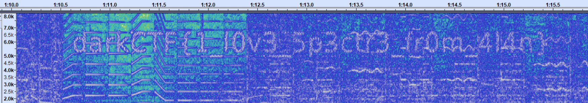
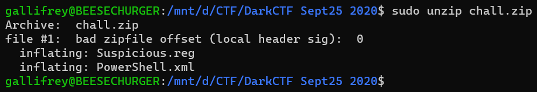

# DarkCTF Writeups
Author: [Gallifrey](https://github.com/gall1frey)

    - [Osint](#osint)
    - [Cryptography](#crypto)
    - [Misc](#misc)
    - [Forensics](#forensics)

# OSINT<a name="osint"></a>
## Find cell
```
I lost my phone while I was travelling back to home, I was able to get back my eNB ID, MCC and MNC could you help me catch the tower it was last found.
note: decimal value upto 1 digit
Flag Format : darkCTF{latitude,longitude}
```
### Solution

Searching for eNB ID on 
https://www.cellmapper.net/map?MCC=310&MNC=410&type=LTE&latitude=32.82059844945921&longitude=-24.577407925948716&zoom=6.337042870587223&showTowers=true&showTowerLabels=true&clusterEnabled=true&tilesEnabled=true&showOrphans=false&showNoFrequencyOnly=false&showFrequencyOnly=false&showBandwidthOnly=false&DateFilterType=None&showHex=false&showVerifiedOnly=false&showUnverifiedOnly=false&showLTECAOnly=false&showENDCOnly=false&showBand=0&showSectorColours=true
fives us the coordinates to the cell tower, 32.82059844945921 and -24.577407925948716

The flag is:
```
darkCTF{32.8,-24.5}
```

## Time Travel
```
Can you find the exact date this pic was taken (It is Australian forest fire)

Flag Format: darkCTF{dd-mm-yyyy}
```
An image file, ```TimeTravel.jpg``` was also given.


### Solution

Reverse google searching yields that the image is courtsey of NASA, taken from the ISS. Going to their website, https://worldview.earthdata.nasa.gov/?v=149.0555510075992,-31.596054937400808,156.75441151318898,-27.81679659025584&t=2019-09-15-T22%3A00%3A00Z&l=VIIRS_SNPP_Thermal_Anomalies_375m_Day(hidden),VIIRS_SNPP_Thermal_Anomalies_375m_Night(hidden),Reference_Labels(hidden),Reference_Features(hidden),Coastlines,VIIRS_SNPP_CorrectedReflectance_TrueColor,MODIS_Aqua_CorrectedReflectance_TrueColor(hidden),MODIS_Terra_CorrectedReflectance_TrueColor(hidden)&tr=australia_fires_2019_2020,
we find that the photo was taken on 15th sept, 2019.

The flag is:
```
darkCTF{15-09-2019}
```

# Cryptography<a name="crypto"></a>

## Pipe Rhyme
```
Chall:- Pipe Rhyme

Chall Desc:- Wow you are so special.

N=0x3b7c97ceb5f01f8d2095578d561cad0f22bf0e9c94eb35a9c41028247a201a6db95f
e=0x10001
ct=0x1B5358AD42B79E0471A9A8C84F5F8B947BA9CB996FA37B044F81E400F883A309B886

```

### Solution

This is a simple RSA challenge. 
On converting N, e and ct to decimal, we get:
```
N = 1763350599372172240188600248087473321738860115540927328389207609428163138985769311
e = 65537
ct = 810005773870709891389047844710609951449521418582816465831855191640857602960242822
```
Using factordb to get the factors p and q, of N:
```
p = 31415926535897932384626433832795028841
q =  56129192858827520816193436882886842322337671
```
Now that we have p, q and e, we can calculate totient and the secret key d as follows:
```
totient = (p-1)*(q-1) = 1763350599372172240188600248087473321682730891266173271675081787918842463868402800
ed≡1modϕ
therefore d = 188047321955721375508157638187334651345661324123156155999468187676652730213105073
```
Then using n and d to decrypt the message, we get:
```
darkCTF{4v0iD_us1ngg_p1_pr1mes}
```

Or, using a simple python script,
```python
from Crypto.Util.number import *
n = 1763350599372172240188600248087473321738860115540927328389207609428163138985769311
ct = 810005773870709891389047844710609951449521418582816465831855191640857602960242822
p = 31415926535897932384626433832795028841
q =  56129192858827520816193436882886842322337671
totient = (p-1)*(q-1)
d = inverse(e,totient)
print(long_to_bytes(pow(ct,d,n)))
```

The flag is:
```
darkCTF{4v0iD_us1ngg_p1_pr1mes}
```

## WEIRD ENCRYPTION
```
I made this weird encryption I hope you can crack it.
```

### File:
```
prefix="Hello. Your flag is DarkCTF{"
suffix="}."
main_string="c an u br ea k th is we ir d en cr yp ti on".split()

clear_text = prefix + flag + suffix
enc_text = ""
for letter in clear_text:
    c1 = ord(letter) / 16
    c2 = ord(letter) % 16
    enc_text += main_string[c1]
    enc_text += main_string[c2]

print enc_text
```
and
```
eawethkthcrthcrthonutiuckirthoniskisuucthththcrthanthisucthirisbruceaeathanisutheneabrkeaeathisenbrctheneacisirkonbristhwebranbrkkonbrisbranthypbrbrkonkirbrciskkoneatibrbrbrbrtheakonbrisbrckoneauisubrbreacthenkoneaypbrbrisyputi
```

### Solution

On close inspection of the code, we know that the encrypted message can be divided into fragments given by the elements of the list ```main_string```.
So we split the encrypted string into said fragments. We get:
```
ea we th k th ...
```
We put that in a list, ```dec_list```, and run the following python code on it to get our flag:
```python
msg = ''
main_string="c an u br ea k th is we ir d en cr yp ti on".split()
dec_list = list() #That list we got
for i in range(0,len(dec_list),2):
  msg += chr(main_string.index(dec_list[i])*16 + main_string.index(dec_list[i+1]))
  
print(msg)
```

output: ```Hello. Your flag is DarkCTF{0k@y_7h15_71m3_Y0u_N33d_70_Br3@k_M3}.```

The flag is:
```
DarkCTF{0k@y_7h15_71m3_Y0u_N33d_70_Br3@k_M3}
```

# Misc<a name="misc"></a>

## Minesweeper
```
I'm lucky to be surrounded by even-minded people from all around. Flag is not in the regular format.

Submit flag in darkCTF{flag} format.
```
A file, minesweeper.txt, with a huge matrix was also provided.

### Solution

Got first blood on this one.
On first look at the challenge, I noticed not as many odd numbers in the matrix as there were even. So I figured the flag lay in those numbers that had even numbers on all four sides, right, left, top and bottom. 

The next part was writing a python script to find those values, and it was simple.
The following script got me the reverse flag. 
```python
array = [[]] #The matrix from the file
req_list = [] #store all required nos
for i in range(len(array)):
    for j in range(1,len(i)-1):
        if mat[i-1][j]%2 == 0 and array[i+1][j]%2 == 0 and array[i][j-1]%2 == 0 and array[i][j+1]%2 == 0:
            req_list.append(chr(array[i][j]))
print(''.join(req_list)) #Prints rev flag

print(''.join(req_list)[::-1]) #Prints flag
```

```
EECNaEITaPDNaNOITaVRESBOEHVaJFHUOYSIGaLF
FLaGISYOUHFJaVHEOBSERVaTIONaNDPaTIEaNCEE
```

The flag is:
```
darkCTF{YOUHaVEOBSERVaTIONaNDPaTIENCEE}
```

## Secret Of The Contract
```
Ropsten network contains my dark secret. Help us find it. Name of the contract was 0x6e5EA18371748Db7F12A70037d647cDFCf458e45
```
### Solution

The address is of a contract in the ropsten network of the etherium blockchain. On searching for the address on https://ropsten.etherscan.io/, we get two transactions.
(The third on was done after I had solved the challenge, but the picture was taken afterwards)


On viewing the data of the two transactions, we see a hex code, divided into three parts:


The message: ``` Hmm-6461726B4354467B337468337233756D5F353730723467335F3772346e3534633731306e7d0 ```

Converting that hex to text, we get the flag.

The flag is:
```
darkCTF{3th3r3um_570r4g3_7r4n54c710n}
```

# Forensics<a name="forensics"></a>

## Wolfie's Contacts
```
Wolfie is doing some illegal work with his friends find his contacts.
```
A file, wolfie.E01 was also provided.

### Solution

Used [OSF Mount](https://www.osforensics.com/tools/mount-disk-images.html) to mount the ```.E01``` file.
It had the following folders:


Contacts looked promising.
Running ```ls -al``` showed us there were 9 contacts.

```drwxrwxrwx 1 gallifrey gallifrey 4096 Sep 28 09:32  .
drwxrwxrwx 1 gallifrey gallifrey 4096 Sep 28 09:32  ..
-rwxrwxrwx 1 gallifrey gallifrey  865 Sep 20 23:52  agent.contact
-rwxrwxrwx 1 gallifrey gallifrey  869 Sep 20 23:52 'Agent P.contact'
-rwxrwxrwx 1 gallifrey gallifrey 1395 Sep 20 23:49  broker.contact
-rwxrwxrwx 1 gallifrey gallifrey 1271 Sep 20 23:49  dealer.contact
-rwxrwxrwx 1 gallifrey gallifrey  863 Sep 20 23:52  Ferb.contact
-rwxrwxrwx 1 gallifrey gallifrey 1251 Sep 20 23:51 'Money Giver.contact'
-rwxrwxrwx 1 gallifrey gallifrey  869 Sep 20 23:52  Phineas.contact
-rwxrwxrwx 1 gallifrey gallifrey 1240 Sep 20 23:51  target.contact
-rwxrwxrwx 1 gallifrey gallifrey 1600 Sep 20 23:48  wolfie.contact
```
grep-ing for the flag using ```cat * | grep dark``` gives us:
```
 <c:Notes>darkCTF{</c:Notes><c:CreationDate>2020-09-20T18:18:41Z</c:CreationDate><c:Extended xsi:nil="true"/>
```
The flag is not complete, but note that it is in the Notes tag.
grep-ing for all Notes tags using ```cat * | grep Notes``` gives us all parts of the flag:
```
 <c:Notes c:Version="1" c:ModificationDate="2020-09-20T18:19:52Z">C0ntacts_
</c:Notes><c:CreationDate>2020-09-20T18:19:12Z</c:CreationDate><c:Extended xsi:nil="true"/>
        <c:Notes>darkCTF{</c:Notes><c:CreationDate>2020-09-20T18:18:41Z</c:CreationDate><c:Extended xsi:nil="true"/>
        <c:Notes>1mp0rtant}</c:Notes><c:CreationDate>2020-09-20T18:21:20Z</c:CreationDate><c:Extended xsi:nil="true"/>
        <c:Notes>4re_
</c:Notes><c:CreationDate>2020-09-20T18:19:55Z</c:CreationDate><c:Extended xsi:nil="true"/>
        <c:Notes>All HAil Wolfiee!!!</c:Notes><c:CreationDate>2020-09-20T18:17:25Z</c:CreationDate><c:Extended xsi:nil="true"/>
```
Re-ordering the flag to make sense, we get ```darkCTF{C0ntacts_4re_1mp0rtant}```

The flag is:
```
darkCTF{C0ntacts_4re_1mp0rtant}
```

## Wolfie's Password
```
 We have found another device which is password protected but he uses same password everywhere find his password

Note: Use the same file provided in Wolfie's Contacts

Flag Format: darkCTF{password}
```
### Solution

In the previous ```.E01``` file, there is a directory called ```not important files```. That directory contains a password protected rar file, ```readme.rar```.
Since the challenge states that Wolfie uses the same password everywhere, it stands to reason that the required password is that of this rar file.

I used ```johntheripper``` to crack the password.
First, I got the hash of the rar file using ```rar2john``` like:

```$ rar2john readme.rar > hash```

Then, used john to crack this hash with a wordlist attack, using rockyou.txt.

```$ john hash --wordlist=/usr/share/wordlists/rockyou.txt```

This gave me the password, ```easypeasy```

The flag is:
```
darkCTF{easypeasy}
```

## AW
```
 "Hello, hello, Can you hear me, as I scream your Flag! "
```
A video file, Spectre.mp4 was also provided.

### Solution

When the usual tools, exiftool, binwalk and hexdump didn't lead anywhere, I figured there was something hidden in the audio itself. 
To view the spectrogram in audacity, I had to install a plugin from https://www.audacityteam.org/download/plug-ins
Afterwards, opening the mp4 file in audacity and viewing the spectrogram got me the flag.



The flag is:
```
darkCTF{1_l0v3_5p3ctr3_fr0m_4l4n}
```

## Powershell

```
I want to know what is happening in my Windows Powershell.
```
A zip file, ```file.zip``` was also provided, which contained a single file, ```file.mp3```

### Solution

Running ```binwalk``` on the extracted ```file.mp3``` (and also the fact that the file won't play in an audio player) tells us that it is actually an archive.
So we rename ```file.mp3``` to ```chall.zip```, and extract it.



We have an xml file for powershell. That's where we look.

This line looks interesting:
```
echo "ZGFya0NURntDMG1tNG5kXzBuX3AwdzNyc2gzbGx9" | base64 -d
```
Upon running that on the terminal, we get our flag: ```darkCTF{C0mm4nd_0n_p0w3rsh3ll}```

The flag is:
```
darkCTF{C0mm4nd_0n_p0w3rsh3ll}
```

## Suspicious

```
Suspicious software created a key. I want that key to track that software.

File Same as in Powershell.
```

### Solution

The file from the previous challenge has another file. A windows registry file called ```suspicious.reg```.
DO NOT OPEN THAT WITH REGEDIT!


Since it has registry entries, we try to search for one of the "suspicious" software.
Grep doesn't work here, for some reason, so I opened the file in a text editor and searched for the word suspicious. That did the trick.

Here's all the interesting stuff I got:
```
[HKEY_USERS\S-1-5-21-1473425136-1446414652-728660776-1000\Software\Policies\Microsoft\SystemCertificates\TrustedPeople\TrustedPeople Flag]
"FLAG"="darkCTF{i_don't_trust_anyone}"
...

[HKEY_USERS\S-1-5-21-1473425136-1446414652-728660776-1000\Software\Suspicious]
@="ZGFya0NURntIM3IzXzFzXzV1NXAxYzEwdXN9"
```

The first flag was a fake one, but decoding the key of the suspicious software from base64 gets us the real flag, ```darkCTF{H3r3_1s_5u5p1c10us}```

The flag is:
```
darkCTF{H3r3_1s_5u5p1c10us}
```
