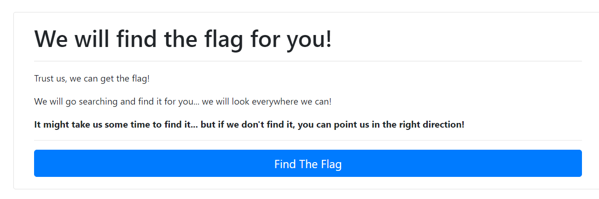

# Misdirection

Author: [Gallifrey](https://github.com/gallifrey)


# Challenge

```
Check out the new Flag Finder service! We will find the flag for you!

Connect here:
http://jh2i.com:50011/
```

# Solution

On visiting the site, you get a button to search for the flag, which redirects you to ```http://jh2i.com:50011/site/flag.php```
and sticks you in a series of redirections and ends up nowhere.



I figured I can wget the final web page by increasing the limit on redirections in wget.

```
wget http://jh2i.com:50011/site/flag.php --max-redirect 120
```
That landed me with this

```html
    <h1 class="card-title">Whoops, sorry!</b></h1>

    <hr>

    <p class="card-text">Looks like we got misdirected...</p>

    <p class="card-text">We weren't able to find the flag for you. Sorry. Can you find it? No? Well, maybe you can find the flag on a different challenge...?</p>

```

The flag isn't on the final page.
It probably is on one of the intermediate pages.

Navigating to ```http://jh2i.com:50011/site/```, we get a list of all the pages. 
We save names of these pages in a text file, then write a python script to get data from each of the pages

```python
import requests

###DATA
f = open('sites','r')
l = f.readlines()
s = list()
flag = dict()
base = 'http://jh2i.com:50011/site/'

s = [i.split()[2] for i in l[1:]]

####REQUESTS
for i in s:
	r = requests.get(base+i, allow_redirects=False)
	if len(r.text) > 5:
		flag[int(r.text.split()[1])] = r.text.split()[-1]
		#print(r.text.split()[1], r.text.split()[-1])

for i in range(len(flag)):
	print(flag[i],end='')
```

And the flag is
```
flag{http_302_point_you_in_the_right_redirection}
```
