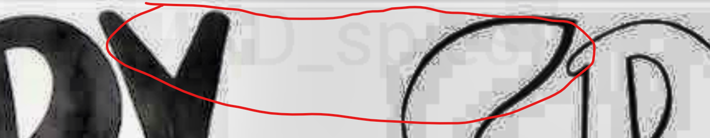

# Spy Vs Spy
Author: [gallifrey](https://github.com/gall1frey)

# Challenge

```
Antonio Prohías was a cartoonist known primarily as the creator of the satirical comic strip
Spy vs. Spy for Mad magazine. It wasn't until after 1997 when the comics changed from black
and white to full color.
```

# Solution

It is a stego challenge, so the obvious first thing was to use stegsolve. But that didn't get me anywhere.
Neither did looking at the exifdata or binwalk.

So I opened the file in an image editor, and tweaked the light and contrast. That got me a partial flag.


```
?????????????spies}
```

So, I'm on the right track. There's two images merged on top of each other.
I used an [online tool](https://incoherency.co.uk/image-steganography/#) to un-merge these images, and got the flag

```
flag{two_MA....
```
