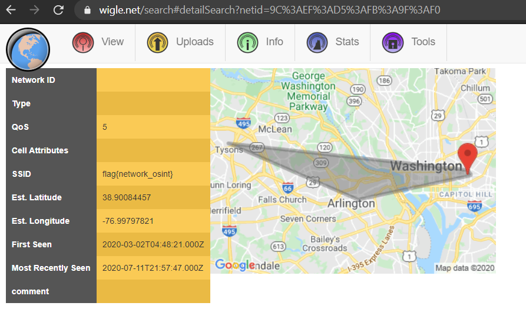

# World Hotspots
Author: [gallifrey](https://github.com/gall1frey)

# Challenge

```
What can you tell me about 9C:EF:D5:FB:9F:F0?
```

# Solution

The given text looks like a BSSID for a wifi. 
Use wigle to search for stuff related to that BSSID



```
flag{network_osint}
```
