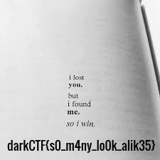

# Really Secure Algo
Author: [Gallifrey](https://github.com/gall1frey)

## Challenge

```
n = 977777777777777777777777777777777777777777777777777777777777777777777777
777777777777777777777777777777777777777777777777777777777777777777777
e = 65537
c = 777100860344719251862233099079929815950590358671816920785821983126
256200182002548130383416252558510764139287733939898022176140368825482344800

Downloads

encrypted.txt
```

## Solution

Aside from the obvious n,e and c given, the name Really Secure Algo (RSA) was a hint at the kindof encryption used.
```n``` in RSA is the product of two large primes, ```p``` and ```q```.
The security of the algorithm depends on having a large enough value for p and q so factorization is a very 
time-expensive process.
The obvious mistake is that ```n``` is small.

We can lookup the factors of ```n``` on factordb.
This gives us:
```
p:
q:
n:
e:
c:
phi (totient, equals the product of (p-1) and (q-1):
```
and we can now compute ```d```:
```
d = e invmod(phi)
d:
```
Now, we can compute plaintext m from ciphertext c using this python script:
```python
#script
```
The flag is:
```
flag{alright_you_have_taken_too_much_time}
```

# Really Find Fish

## Challenge

```
Yeah! I finally got fish from a river (all text is in single line has been broken to accomdate clearly in the card)

xxkxxxxkxxxxxxxxxxxxxxxxxxxxxxxxxxxxxxxxxxxxcdddcxxxxxxxxxxxxxxxxxc
dddddddcddddddddddddddddddddddddddddddddddddddddcxxxxxxxxxxxxxxxxxc
ddddddddddddddcxxxxxxxxxxxxxxxxxxxxxxxxxxxxxxxxxxxxxxxxxxxxxxxxxxxx
xcddddddddddddddddddddddddddddddddddddcxxxxxxxxxxxxxxcxxxxxxxcddddd
ddddcdddddddddddddddddddddddddddddddddddddddddddddddddddcxxxxxxxxxx
xxxxxxxxxxxxxxxxxxxxxxxxxxxxxxxxxxxxxxxxxxxxxxxxxxxcddddddddddddddd
dddddddddddddddddddddddddddddddddddddddddddcxxxxxxxxxxxxxxxxxxxxxxx
xxxxxxxxxxxxxxxxxxxxxcdddddddddddcddddddddddddddddddddddddddddddddd
dddcxxxxxxxxxxxxxxxxxxxxxxxxxxxxxxxxxxxxxxxxxxxxxxxcddddddddddddddd
ddddddddddddcddddddddddddddddcxxxxxxxxxxxxxxxxxxxxxxxxxxxxxxxxxxxxx
xxxxxxxxxxxxxxxxxxxxxxxxxcdddddddcddddddddddddddddddddddddddddddddd
ddddddddddddddddddddddcxxxxxxxxxxxxxxxxxxxxxxxxxxxxxxxxxxxxxxxxxxxx
xxxxxxxxxxxxxxxxxxcdddddcxxxxxxxxxxxxcddddddddddddddddddddddcxxxxxx
xxxxxxxxxxxcddddddddddddddcxxxxxxxxxxxxxxxxxxxxxxxc
```

## Solution

Right off the bat I knew this was an esolang. I didn't know which, but a little googling got me there.
Then I used decode.fr 's deadfish decoder to get the flag.

The flag is:
```
darkCTF{Welc0m3_T0_D4rk4rmyctf}
```

# Gene Encryption

## Challenge

```
Something related to genes ?
Flag is underscore separated with braces around it 
enc
```

## Solution

I was stuck for a while here, but johnhammond's [ctf-katana](https://github.com/JohnHammond/ctf-katana) helped me out.
I then wrote a code for it in python, but later I found that the whole thing was available easily on decode.fr.

```python
#code
```

The flag is:
```
darkCTF{}
```

# No More Remorse

## Challenge

```
Sometimes, what you see is not what you get!! nomoreremorse
```

## Solution

I spent a lot of time on this trying to figure it out, and it was a whole trip!
Notice the morse code doesn't have delimiters like traditional morse, and that the string length is a multiple of five.

That points to a baudot code. So now we split the morse code into chunks of five characters.
```
.-.-- .---- .---- .-..- --.-. ..-.. -...- ...-. ...-. ..... .---- --..- -..-- .-.-. --... -.-.- 
.--.- ..-.. ...-- ..... -...- ..--- ...-- ..-.. ...-. ..... --.-. .-.-- ..--- --... .---- ----. 
--... -.-.- ----. -.... ---.. ---.. ..-.- ---.. --..- -..-- 
```
Then we replace dashes with 0 and dots with 1.
```
10100 10000 10000 10110 00101 11011 01110 11101 11101 11111 10000 00110 01100 10101 00111 01010 
10010 11011 11100 11111 01110 11000 11100 11011 11101 11111 00101 10100 11000 00111 10000 00001 
00111 01010 00001 01111 00011 00011 11010 00011 00110 01100 
```
And put it through the baudot decoder on decode.fr
```
	HTTPS://TINYURL.COM/SHOUTEUREKAAGAIN
```
we get a pastebin link, which we follow to get a weirdly formatted text.

hｔtpｓ：//іmgur．сοｍ/a／d2ｈhｄHlνｄＸNｚWlｚd2hｈｄHｌvｄＷdldC5５b３ｖqdΧＮ0bmVlZΗRvϹ２VｌｂGｌrＺΧＲoҮＸＲrZWVwdH

The link doesn't lead anywhere, and there are some sort of misleading messages in the base64 string at the end of the link.
But the interesting part is the formatting.
It is homoglyph steganography. On decoding it from https://twsteg.devsec.fr/ , we get another link:

```shorturl.at/bemz1```

On visiting the link, there is a photo, with the flag in it.



The flag is:
```
darkCTF{s0_m4ny_lo0k_alik35}
```
