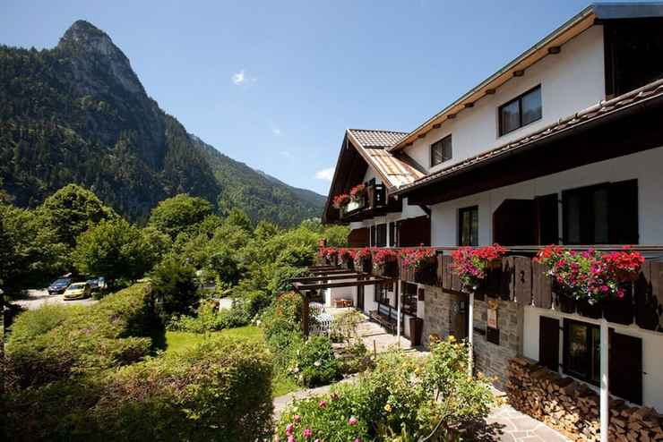
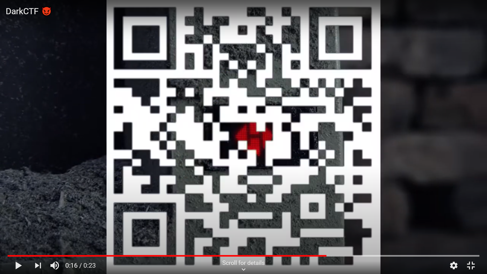

# OSINT-Starter
Author: [Gallifrey](https://github.com/gall1frey)

## Challenge
```
What operator is used for defining location in google search?

Flag Format: darkCTF{operator:}
```
## Solution

Basic googling gives you the operator loc. Also check other operators (here)[https://www.spyfu.com/blog/google-search-operators/]

The flag is:
```
darkCTF{loc:}
```

# catch me if you can

## Challenge
```
Mr.n00b sent me anonymous mail with a message saying "Catch ME If y0u can" and there's 
file attached to it. Find the current location of Mr.n00b.
flag format : darkCTF{building_name} (all small letters)
```
An image file, ```location.jpg``` was also given.



## Solution

Reverse google searching that image takes you to https://www.kayak.co.in/Oberammergau-Hotels-Das-Posch-Hotel.254155.ksp
The name of the hotel is Das Posch Hotel

The flag is:
```
darkCTF{das_posch_hotel}
```

# Anna-Cappadocia

## Challenge
```
Do you remember the first time we attended the festival at Cappadocia in Turkey in 2019? I can't remember the name of the festival we attended, but if you find it somehow, you will find the flag.

https://www.youtube.com/watch?v=8jMzsPB2MSg

Flag Format: darkCTF{FESTIVALNAME}
```

## Solution

On watching that video, and googling, we get to know that Cappadocia, Turkey was where the first international
balloon festival was held. 
After this the challenge becomes quite guessy, but the answer was BALL00N (with zeroes)

The flag is:
```
darkCTF{BALL00N}
```

# Promotion

## Challenge
```
Did you see all our promotions in detail if not.
go see again and don't forget to follow us on social media.
```

## Solution

There were two promotionsl videos released by DarkArmy, one of which had the flag.
```https://www.youtube.com/watch?v=Nt6yebQptQ0```
This was the video with the flag. On watching the video, a QR code pops up on the screen for a single frame. 



Scanning that QR code gets you the flag.

The flag is:
```
darkCTF{6o1n6_7hr0u6h_7h3_Fr4m3s}
```

# Mr N00bs channel

## Challenge
```
We have found out that Mr.n00b started his youtube channel. find the channel and there you'll find flag.
  Author Note: location.jpg in previous challenge might help you.
```

## Solution

I actually sort of stumbled across this while doing the previous mr. N00b chall. Was a hell of a rabbit hole.

On running ```exiftool``` on location.jpg, we come across a comment from mr.N00b, which gives us his twitter handle.

 ```mrn00b1337```
His bio says that he's a youtuber. So, we need to find his youtube username.
On scrolling to the very bottom of his twitter feed, we find a link to his channel, with only one video.

```https://www.youtube.com/channel/UCfiPiuhOt5ctM0LQWAJeNYg```

I opened the video, and there is a morse code in the description, which basically says ```DARKCTFTH1515F4K3F14G```.
There was nothing else on the channel, nothing that we ould see, at least.

So, I googled youtube OSINT, and found a [website](https://mattw.io/youtube-metadata/) that gives us the meta tags of a video.

```
"tags": [
        "darkCTF{",
        "t4gs",
        "4re",
        "import4nt}"
    ],
```

The flag is:
```
darkCTF{t4gs_4re_import4nt}
```
